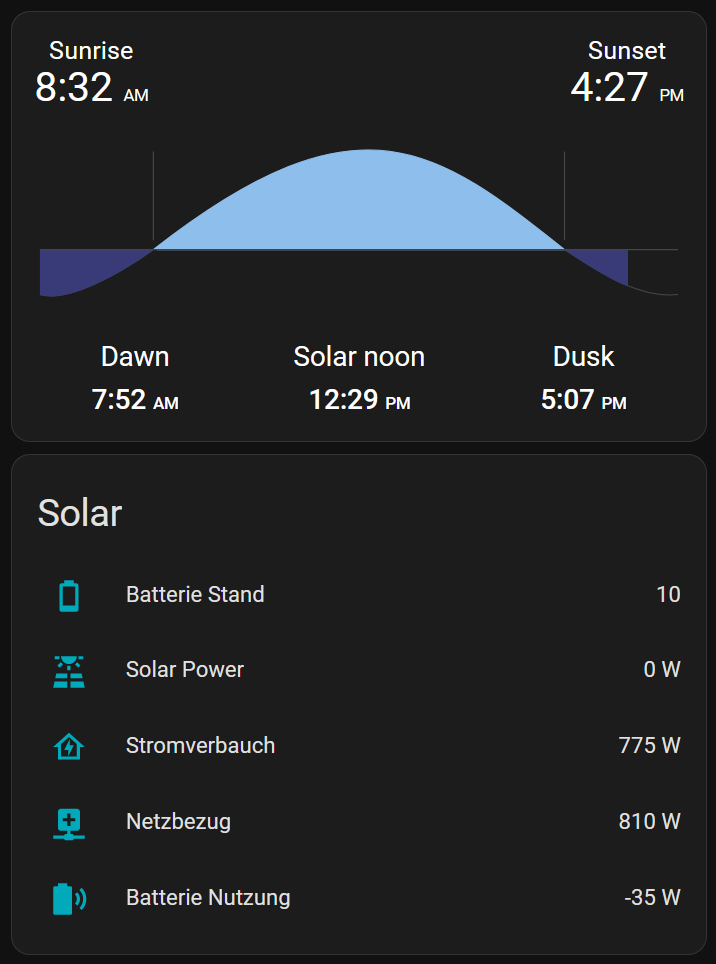

# Plexlog HomeAssistant AddOn

# Note
I have finally found a way to read out the module using the Modbus protocol over the local network. Therefore, this integration will be archived. Please use the new integration instead:  :tada: .
---


### This Addon will allow you to add Plexlog to your HomeAssistant 

### Features

- Read CurrentPowerSolar :sun_with_face: , BatterieLevel :battery:, NetworkUsage :dollar:, BatterieUsage :electric_plug:
- Built with MQTT, Nodejs



## How to use this AddOn

1. Add this Repo to your AddOn Store inside HA
2. Install the AddOn
3. Go to Configuration and add the needed Login Data from Plexlog and MQTTServer
4. Add the MQTT Entities into your Configuration
5. Have fun!  :tada:

## FAQs 

### How to I get my DashboardID?

Go to Plexlog open the Network Tab on Developer Setting and check the Websocket.

## MQTT Template for Entities
```
sensor x:
  platform: mqtt
  name: "CurrentPowerSolar"
  state_topic: "solar/CurrentPowerSolar"
  qos: 0
  unit_of_measurement: "W"
  unique_id: currentpowersolar      

sensor x:
  platform: mqtt
  name: "BatterieStand"
  state_topic: "solar/BatterieStand"
  qos: 0
  unique_id: batteriestand  
  
sensor x:
  platform: mqtt
  name: "CurrentUsage"
  state_topic: "solar/CurrentUsage"
  qos: 0
  unit_of_measurement: "W"
  unique_id: currentusage  

sensor x:
  platform: mqtt
  name: "CurrentUsageFromNetwork"
  state_topic: "solar/CurrentUsageFromNetwork"
  qos: 0
  unit_of_measurement: "W"
  unique_id: currentusagefromnetwork 
  
sensor x:
  platform: mqtt
  name: "CurrentBatterieLoadingAmount"
  state_topic: "solar/CurrentBatterieLoadingAmount"
  qos: 0
  unit_of_measurement: "W"
  unique_id: currentbatterieloadingamount 

```

## Roadmap 

- Support Local Readout of Unit!!

